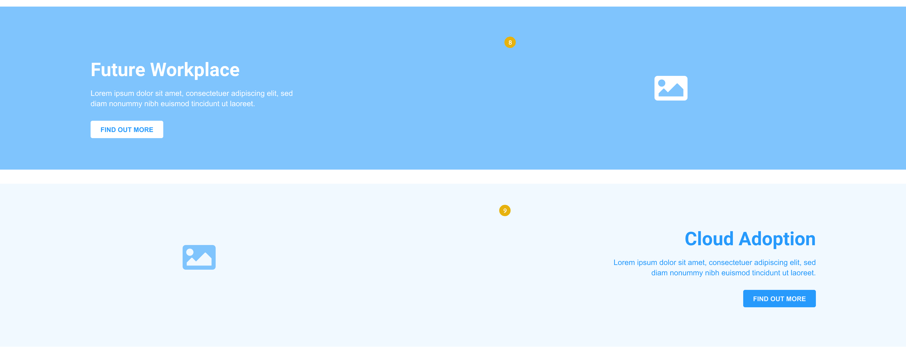

# Types of editing block reference

- **The Hero**: Big background image with a heading and a short text. It's used at the top of every page. On the blog it also has a pre-heading and a CTA
- **The Lover**: Heading and text. Normally displayed right under the hero.
  

- **The Magician**: Medium-sized image heading text and CTA.
  

- **The Outlaw**: 3 items of Image (maybe icon?) Heading, small paragraph and CTA.
  

- **The Sage**: Used for testimonials. Text for a quote and field for the author.
  

- **The Ruler**: Heading and team members
  

- **The Explorer**: Used for a slideshow of items that contain Heading, very short text, image and CTA
  

- **The Innocent**: Image and medium-sized paragraph
  

- **The Creator**: Heading, short text, image, CTA and a toggle to swap image and text sides
  

- **The Caregiver**: Two of Heading, text, image and CTA
  

- **The Jester**: Icon, Heading, short text, image, CTA and a toggle to swap image and text sides
  

- **The Everyman**: Content in tabs. Tab title and button to add other content types, as many as necessary.
  
